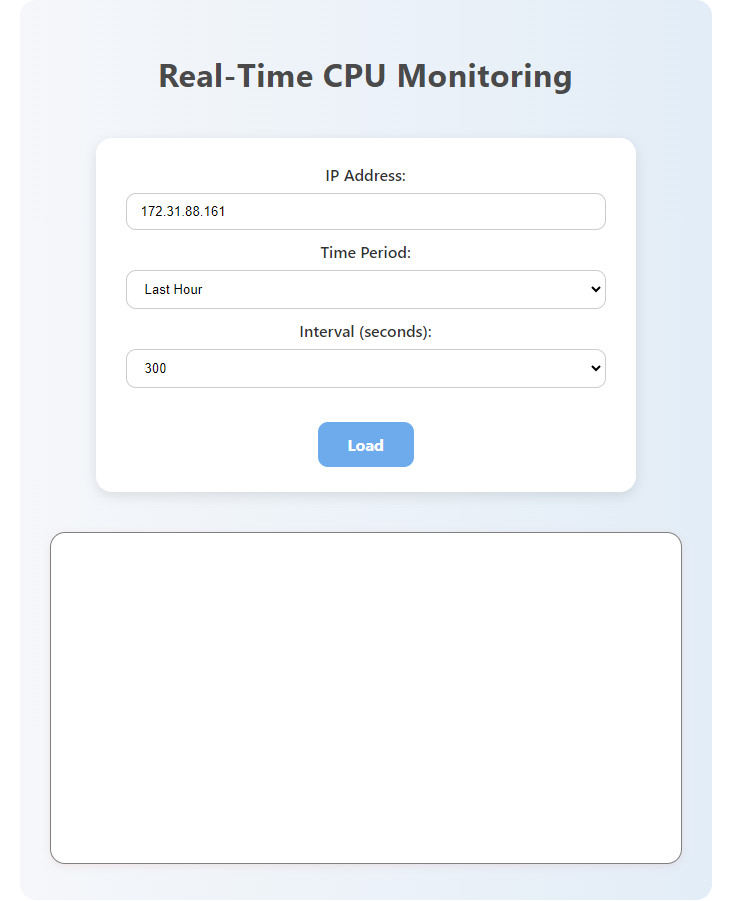
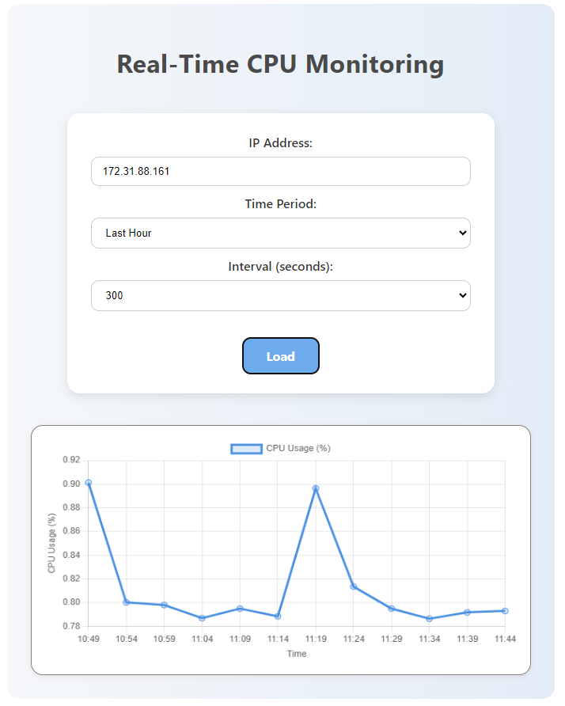
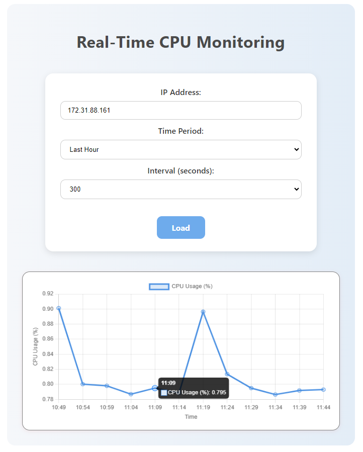

# CPU-Monitor
This web dashboard allows you to monitor CPU usage of a remote EC2 instance in real-time using AWS CloudWatch metrics.  
Built with **Vue.js**, **Chart.js**, and a **Node.js** backend.


## Screenshots
### Home Screen


### Load CPU Monitoring



## Features
- Real-time CPU monitoring from AWS CloudWatch
- Dynamic selection of time ranges and intervals
- Line chart visualization using Chart.js
- Clean and intuitive user interface

## How To Use
1. Clone the repository using the command:  
```git clone https://github.com/LiorAmitay1/cpu-monitor.git```
2. Then navigate into the project folder using:  
```cd cpu-monitor```
3. Install the dependencies by running:  
```npm install```
4. To start the frontend, run:  
```npm run dev```
5. To start the backend, run:  
```node server.js```

## Configuration
Create a .env file with your AWS credentials:
```AWS_ACCESS_KEY_ID=your_access_key
AWS_SECRET_ACCESS_KEY=your_secret_key
AWS_REGION=your_region```
You can copy the structure from the provided .env.example file.


Once everything is running, open your browser at http://localhost:5173  
Enter the EC2 instance IP, select a time range and interval, and click "Load" to view the CPU usage chart in real-time.

## Created by
- Lior Amitay

## Have Fun!
